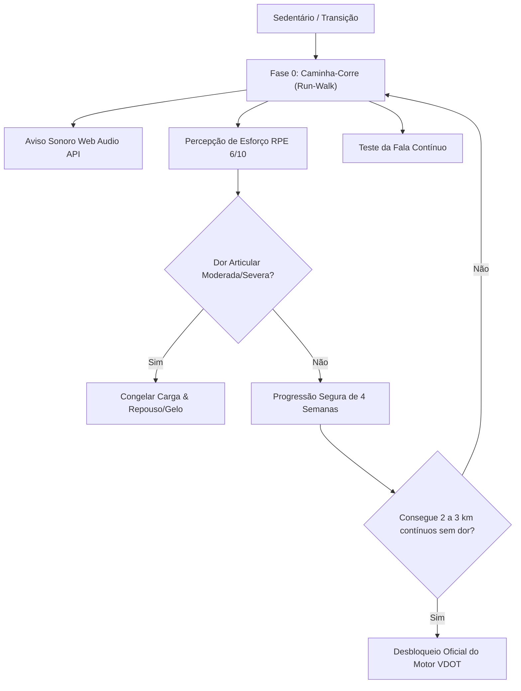

# Padrão: Fase 0 - Transição Segura & Método Caminha-Corre (Run-Walk)

- **ID do Padrão**: `PAD-014-RUN-WALK-TRANSITION`
- **Contexto**: [[PaceLab-VDOT-v3.5]]
- **Data**: 2026-09-23
- **Tags**: #corrida #fisiologia #caminha-corre #jack-daniels #vdot #seguranca-articular

---

## 1. Contexto e Problema Fisiológico

O sistema **VDOT** concebido pelo Dr. Jack Daniels é uma ferramenta matemática de altíssima precisão para cálculo de ritmos de treinamento contínuo (E, M, T, I, R). No entanto, suas tabelas começam em desempenhos equivalentes a VDOT ~30 (ex.: 5 km contínuos em ~30 minutos).

Ao tentar submeter um praticante **sedentário**, **acima do peso** ou **em retorno de longo período parado** a um teste formal all-out de VDOT (como 2.400m, teste de Cooper ou 5k máximo), ocorrem graves riscos:
1. **Sobrecarga Articular e Tendínea**: Os tendões (especialmente Aquiles e patelar) e as fáscias demoram de 3 a 6 vezes mais para se adaptar mecanicamente do que o sistema cardiovascular.
2. **Picos Cardíacos Excessivos**: Disparo imediato para a Zona 5 (Karvonen > 90%), sem base mitocondrial prévia.
3. **Canelite (Periostite Tibial)**: Impacto de aterrissagem com cadência baixa e passada à frente do centro de gravidade.

---

## 2. A Solução: Método Caminha-Corre por Tempo

Antes do VDOT, o foco exclusivo deve ser a **Adaptação Musculoesquelética**:

---

## 3. Protocolo de 4 Semanas (3x/semana em dias alternados)

| Semana | Aquecimento | Estrutura da Sessão (Repetir 3x) | Desaquecimento | Tempo Total |
| :--- | :--- | :--- | :--- | :--- |
| **Semana 1** | 5 min caminhada firme | **10x (1 min trote leve + 2 min caminhada)** | 5 min caminhada leve | 40 min |
| **Semana 2** | 5 min caminhada firme | **8x (1 min 30s trote leve + 2 min caminhada)** | 5 min caminhada leve | 38 min |
| **Semana 3** | 5 min caminhada firme | **7x (2 min trote leve + 2 min caminhada)** | 5 min caminhada leve | 38 min |
| **Semana 4** | 5 min caminhada firme | **6x (2 min 30s trote leve + 1 min 30s caminhada)** | 5 min caminhada leve | 34 min |

---

## 4. Entidades Semânticas para o [[Graphify]]

- **Entidade**: `RunnerLevel` (`sedentary_transition` | `beginner` | `intermediate` | `advanced`)
- **Entidade**: `RunWalkInterval` (`reps`, `runDurationSec`, `walkDurationSec`, `targetRpe`)
- **Entidade**: `VdotReadiness` (`readinessPercentage`, `continuousRunRecordSec`, `unlockedVdot`)
- **Módulo**: `src/lib/runWalkEngine.ts`
- **Componentes**: `src/components/LiveRunWalkModal.tsx`, `src/components/TrainingPlanTab.tsx`

---

## 5. Relações e Links no Obsidian

- Conecta com: [[01-padroes/padrao-karvonen-vdot]]
- Conecta com: [[02-decisoes/decisao-bloqueio-vdot-iniciante]]
- Conecta com: [[06-aprendizados/aprendizado-seguranca-tendinea]]
